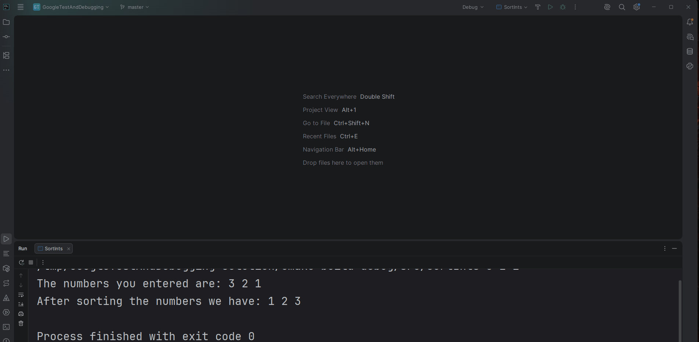
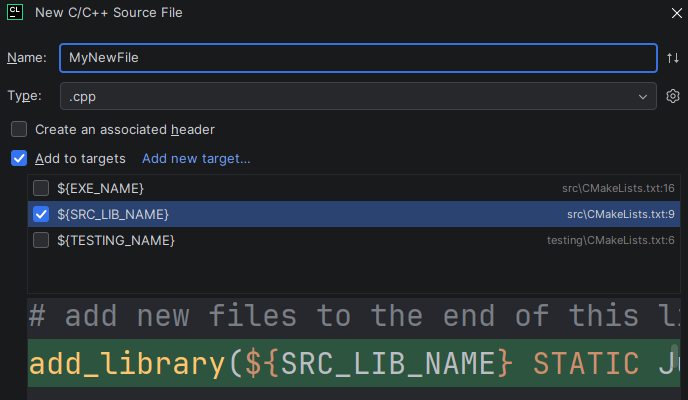
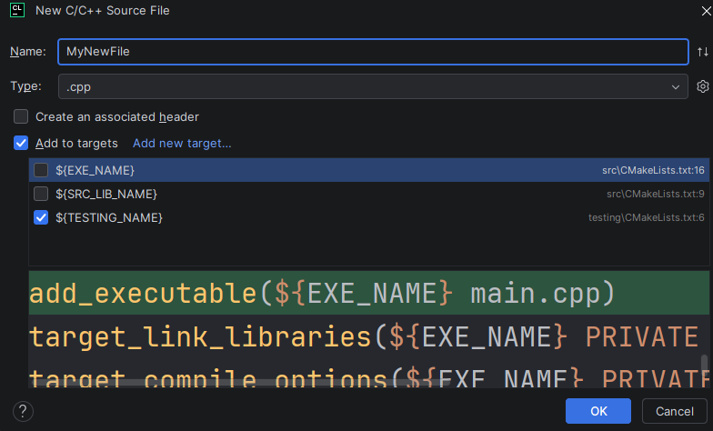

# BattleShip

## Matthew’s Stats

- Time Taken: A weekend
- Lines Of Code: ~1500
- Files: 41

## Problem Description
You will be implementing the game of BattleShip. The game starts with each player 
secretly placing their ships on their board. A ship can be placed either horizontally 
or vertically on their board. Once the players have finished placing their ships, they take
turns guessing locations on their opponent's board to fire. Their opponent announces
whether the shot hits or misses their ship and if it is the final hit on their ship,
the fact that that shot destroyed their ship. 

You can play a [**version** of BattleShip here](https://www.battleshiponline.org) and I recommend that you do so if you 
haven’t played the game before.

## Requirements

- All of your code must be in a namespace named `BattleShip`
- You must have at least 3 user defined classes and used them in your solution
- You must appropriately use public and private. 
  - You should **NOT** make everything public because it “makes things easier”
  
**Failure to follow these restrictions will result in serious point deductions** from your submission.

## Input
  Input will come from 3 locations: the command line, files, and standard input.

### Command Line
  
#### Argument 1
  
- Required
- The path to the configuration file for this game
- This value will always be valid
  
### Configuration File
The configuration file specifies
  
1. The size of the board
2. The number of ships to be placed on the board
3. The character used to represent each ship
4. The size of each ship

The format of the file looks like

1. Number of rows on the board
2. Number of columns on the board
3. Number of ships to be placed
4. Ship1_Character Ship1_Size
5. Ship2_Character Ship2_Size
6. ...


For example, the configuration file of a traditional game of Battleship 
that is played on 10 X 10 board with a Carrier that is 5 long, a 
Battleship that is 4 long, a Destroyer that is 3 long, a Submarine that is 3 long, 
and a Patrol Boat that is 2 long looks like

```terminaloutput
10
10
5
C 5
B 4
D 3
S 3
P 2
```

The contents of this file **will always be valid.**

You can find a few example configuration files [SampleGameConfigurations](SampleGameConfigurations).

### Standard Input (Keyboard)

- This is how the user will specify 
  1. Where to place their ships 
  2. What location on the board to fire at. 
- Input will **NOT** always be valid. 
- If invalid input is entered the user should be prompted for input until valid input is entered

## Output
The output is a bit too complicated to specify here what it should look like. 
Please look at the examples at the end to see what output should look like

## Setting Up The Game
The player will first be asked for their name and then will be asked to place their ships. 
Ships are placed in ASCII order based on the character used to represent the ship.

- For each ship
  1. The player’s board should be displayed
  2. The player should be asked if they want to place the ship horizontally or vertically
    - `H` or `h` represents horizontal and `V` or `v` represents vertical
      - Repeatedly prompt for valid input if invalid input is entered
  3. They will then be asked for the starting coordinate they want to place the ship at
     - This will be the leftmost point if the ship is placed horizontally
     - This will be the topmost point if the ship is placed vertically
     - If invalid input is entered go back to step 2
     - If the ship can be legally placed at the location it should be placed there but if it can’t go back to step 2
       - A placement is legal if
         - The ship can fit there without going off the board
         - The ship does not overlap with any of the ships that have already been placed.

## Getting A Users Move

- The user should enter where they want to shoot out in the form `row column`. 
  - If an invalid move is entered, you should keep asking the user for a valid move
  - until they enter one. A move is considered valid if
    - The user entered two integers separated by space
    - The coordinate they choose is on the board
    - They have not shot there already

  
## Future Extensions
You will be building upon this project in the next assignment. In that assignment you
will be adding some very simple “AIs” to the game. Because of this it is important that
your solution be
1. Well organized. 
   - If it works but is terribly put together the next assignment will be 
      much harder for you
2. Plan for the extension around Players. This means that you
   1. Don’t directly declare instances of Players. Instead, make your Players 
      using smart pointers (probably `unique_ptrs`).
   2. Don’t directly pass instances of players around. Instead, use references and pointers.  
   
If you don’t end up completing the assignment, or you just want to, you can build on my solution, 
which will be released after this assignment is due. This can be a challenge as you’ll have
to figure out how my code works and how I think.
   
## Hints and Musings

1. Start early. This is going to take some time so give yourself the time to do it.
2. Come up with a plan before coding! If you don’t have a plan before you start writing you will end up in a world of hurt
   - Think about the things a game of Battleship is composed of and what they should do and how they should interact
3. The most time-consuming part of the project is getting the game setup. Once all the boards and players are in place it is quite straightforward to implement the gameplay logic
4. What you store and what you display do NOT have to be the same thing
   - You don’t have to have a vector of strings to represent the board
   - You don’t have to store the spaces in between cells
   - You could have an easy to work with model of the game and then figure out how to print it to the screen
   
## Example
   You can find an example of game play in [example_game.md](example_game.md)

## CLion Specifics

### Setting Command Line Arguments
Command line arguments can be set by
1. Going to the configuration you want to add command line arguments to
2. Clicking  `...` next to the configuration
3. Selecting `Edit...`
4. Entering your command line arguments in `Program Arguments`



## What to Submit

Submit to GradeScope a clone of this repository with updates to it to solve the problem described.
You are allowed to create as many new files under `src` or `testing` as you
desire. 

- If you create new files under `src` make sure to add them to `${SRC_LIB_NAME}`
  - 
- If you create new files under `testing` make sure to add them to `${Testing_Name}`
  - 
